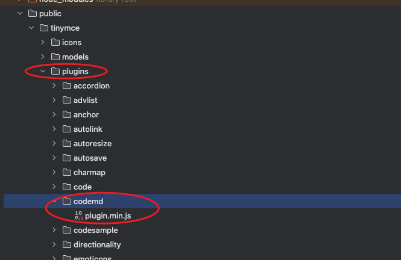
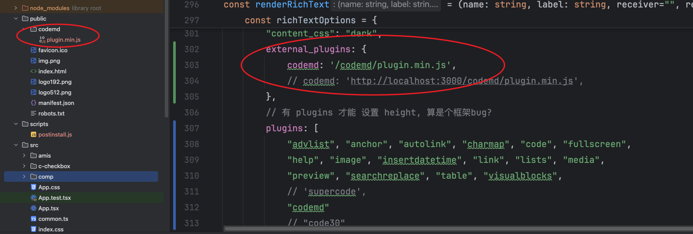

# CHANGELOG

## 0.2.2

- 按钮图标更新
- 按钮调用节流
- 按钮tooltip更新
- 补充返回元数据
- 自动聚焦到当前编辑器

## 0.2.1

- 禁用工具栏按钮时, 延迟调用禁用, 避免tinymce其它策略/插件重新启用
- 禁用工具栏按钮时, 记住上次状态, 避免启用状态错误
- md模式下禁用工具栏按钮, 兼容6.x版本
- md模式下禁用工具栏按钮(7.x版本)
- 去除textarea的外轮廓
- 移除没用的js

## 0.2.0

针对上个版本必须配置自己的 `markdown - html` 转换方法的问题, 
此版本内置了简单的转换方法, 觉得转换结果不满意的, 可以自行实现自己的转换方法

且解决了上个版本三方库导入的问题, 现在采用 `umd` 格式内联了 `markdown - html` 转换的三方库.

另外, 将弹出 `Dialog` 编辑的方式, 换成直接在原来的编辑器上编辑/预览

## 0.1.0

此插件功能

- 支持使用 `tinymce` 时, 进行markdown源码编辑

### 使用

将生成的 `plugin.min.js` 复制到 `插件目录` 



在自己的项目安装以下模块

```bash
yarn add turndown markdown-it  --save
```

再将 [text-convert.ts](resources/ts/text-convert.ts) 拷贝到自己的项目,
这是为了实现markdow与html的互相转换.

为什么不直接写到插件内部? 插件是前端库, 编译的require是node才能用的,
全部弄到插件代码里, 可能会跟外部库有重复, 另外就是内网不方便用cdn,
所以三方库调用自行实现

最后上代码(React版本)

```typescript jsx
import { useRef } from 'react';
import { Editor } from '@tinymce/tinymce-react';
import {TextConvert} from "./text-convert.ts";


const TinyEditor = () => {
    const editorRef = useRef<Editor | null>(null);
    const log = () => {
        if (editorRef.current) {
            // @ts-expect-error has getContent
            console.log(editorRef.current?.getContent());
        }
    };
    return (
        <>
            <Editor
                tinymceScriptSrc='/tinymce/tinymce.min.js'
                licenseKey='gpl'
                // @ts-expect-error office-use
                onInit={(_evt, editor) => editorRef.current = editor}
                initialValue='<p>This is the initial content of the editor.</p>'
                init={{
                    skin: "oxide-dark",
                    content_css: ["dark"],
                    height: 500,
                    menubar: false,
                    plugins: [
                        'advlist', 'autolink', 'lists', 'link', 'image', 'charmap',
                        'anchor', 'searchreplace', 'visualblocks', 'code', 'fullscreen',
                        'insertdatetime', 'media', 'table', 'preview',
                        // 'help',
                        'wordcount',
                        'codemd',
                    ],
                    toolbar: 'undo redo codemd | blocks | ' +
                        'bold italic forecolor | alignleft aligncenter ' +
                        'alignright alignjustify | bullist numlist outdent indent | ' +
                        'removeformat ',
                    content_style: 'body { font-family:Helvetica,Arial,sans-serif; font-size:14px }',
                    codemd: {
                        htmlToMd: (text: string) => TextConvert.shared.convertHtmlToMd(text),
                        mdToHtml: (text: string) => TextConvert.shared.convertMdToHtml(text),
                    }
                }}
            />
            <button onClick={log}>Log editor content</button>
        </>
    );
}


export default TinyEditor

```

## 其它方式使用

| 图例是react项目

使用官方提供的 `external_plugins` 参数




