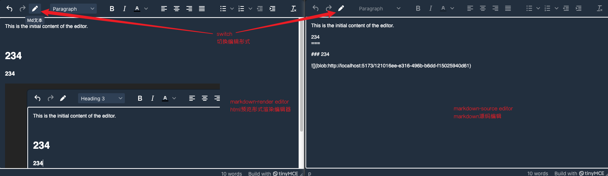

# tinymce-md-code

此插件功能

- 支持使用 `tinymce` 时, 进行markdown源码编辑

## 使用方案一

将生成的 `plugin.min.js` 复制到 `插件目录`


代码(React版本)

```typescript jsx
import { useRef } from 'react';
import { Editor } from '@tinymce/tinymce-react';
import {TextConvert} from "./text-convert.ts";


const TinyEditor = () => {
    const editorRef = useRef<Editor | null>(null);
    const log = () => {
        if (editorRef.current) {
            // @ts-expect-error has getContent
            console.log(editorRef.current?.getContent());
        }
    };
    return (
        <>
            <Editor
                tinymceScriptSrc='/tinymce/tinymce.min.js'
                licenseKey='gpl'
                // @ts-expect-error office-use
                onInit={(_evt, editor) => editorRef.current = editor}
                initialValue='<p>This is the initial content of the editor.</p>'
                init={{
                    skin: "oxide-dark",
                    content_css: ["dark"],
                    height: 500,
                    menubar: false,
                    plugins: [
                        'advlist', 'autolink', 'lists', 'link', 'image', 'charmap',
                        'anchor', 'searchreplace', 'visualblocks', 'code', 'fullscreen',
                        'insertdatetime', 'media', 'table', 'preview',
                        // 'help',
                        'wordcount',
                        'codemd',
                    ],
                    toolbar: 'undo redo codemd | blocks | ' +
                        'bold italic forecolor | alignleft aligncenter ' +
                        'alignright alignjustify | bullist numlist outdent indent | ' +
                        'removeformat ',
                    content_style: 'body { font-family:Helvetica,Arial,sans-serif; font-size:14px }',
                    /// 自行决定是否自定义 md - html 转换方法
                    // codemd: {
                    //     htmlToMd: (text: string) => TextConvert.shared.convertHtmlToMd(text),
                    //     mdToHtml: (text: string) => TextConvert.shared.convertMdToHtml(text),
                    // }
                }}
            />
            <button onClick={log}>Log editor content</button>
        </>
    );
}


export default TinyEditor

```

效果预览



### 自定义文本转换方法

转换方法可以参考 [text-convert.ts](resources/ts/text-convert.ts) 
, 代码(React版本)

```typescript jsx
import { useRef } from 'react';
import { Editor } from '@tinymce/tinymce-react';
import {TextConvert} from "./text-convert.ts";


const TinyEditor = () => {
    const editorRef = useRef<Editor | null>(null);
    const log = () => {
        if (editorRef.current) {
            // @ts-expect-error has getContent
            console.log(editorRef.current?.getContent());
        }
    };
    return (
        <>
            <Editor
                tinymceScriptSrc='/tinymce/tinymce.min.js'
                licenseKey='gpl'
                // @ts-expect-error office-use
                onInit={(_evt, editor) => editorRef.current = editor}
                initialValue='<p>This is the initial content of the editor.</p>'
                init={{
                    skin: "oxide-dark",
                    content_css: ["dark"],
                    height: 500,
                    menubar: false,
                    plugins: [
                        'advlist', 'autolink', 'lists', 'link', 'image', 'charmap',
                        'anchor', 'searchreplace', 'visualblocks', 'code', 'fullscreen',
                        'insertdatetime', 'media', 'table', 'preview',
                        // 'help',
                        'wordcount',
                        'codemd',
                    ],
                    toolbar: 'undo redo codemd | blocks | ' +
                        'bold italic forecolor | alignleft aligncenter ' +
                        'alignright alignjustify | bullist numlist outdent indent | ' +
                        'removeformat ',
                    content_style: 'body { font-family:Helvetica,Arial,sans-serif; font-size:14px }',
                    codemd: {
                        htmlToMd: (text: string) => TextConvert.shared.convertHtmlToMd(text),
                        mdToHtml: (text: string) => TextConvert.shared.convertMdToHtml(text),
                    }
                }}
            />
            <button onClick={log}>Log editor content</button>
        </>
    );
}


export default TinyEditor

```

## 使用方案二

此方案不将 `plugin.min.js` 复制到 `插件目录`, 
而是使用官方提供的 `external_plugins` 参数


其它操作与 `方案一` 一致


